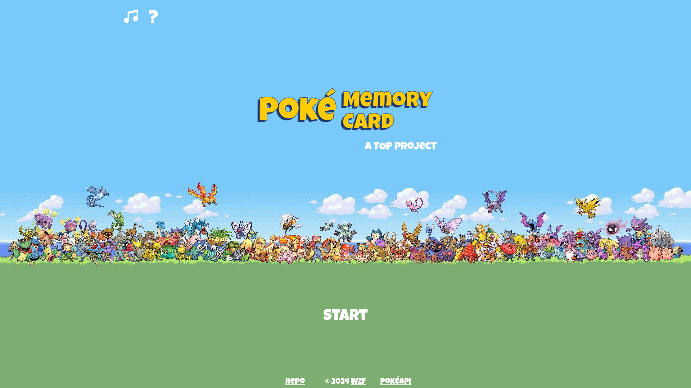
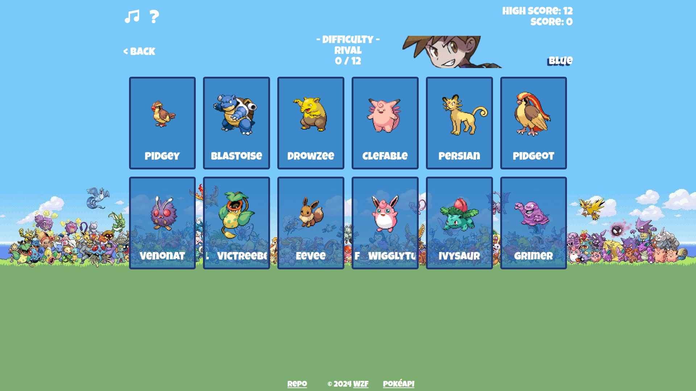

# Poké Memory Card

### [Demo](#)

### Disclaimer:

This game is not associated with The Pokémon Company in any way. It is
developed solely for the purpose of learning. I do not take credit for any of
the names, graphics, sounds and musics used. All credits belong to their
rightful owners.

### About:

A project for The Odin Project: React Course's [Project: Memory Card](https://www.theodinproject.com/lessons/node-path-react-new-memory-card).

A memory card game inspired by Pokémon, featuring Generation 1 characters and Pokémon (sprites and cries from [PokéAPI](https://pokeapi.co/)).

Made with React + Vite

### Game Features:

- 4 difficulties
- Intro (can be skipped)
- Loading screen
- Game screen
- Result screen
- Help screen
- Background music
- Sound effect
- Toggle Music On / Off (setting saved in localStorage together with High Score)

### Features:

- Responsive Design

### Screenshots:

### Language:

- HTML
- CSS
- JavaScript

### Library:

- React
- [howler.js](https://howlerjs.com/)

### Framework:

- Tailwind CSS

### NPM package:

- [React Smart Ticker](https://www.npmjs.com/package/react-smart-ticker)

### Formatter:

- Prettier

### Resources:

- [Background image](https://wallpapercave.com/w/wp8695692)
- [Music icon](https://pictogrammers.com/library/mdi/)
- [Pokéball image](https://commons.wikimedia.org/wiki/File:Pok%C3%A9_Ball_icon.svg)
- [Pokémon Trainer sprites](https://bulbapedia.bulbagarden.net/wiki/Pok%C3%A9mon_Trainer)
- [Pokémon Gym Leader sprites](https://bulbapedia.bulbagarden.net/wiki/Gym_Leader)
- Pokémon Red / Blue Soundtrack

### Possible Improvements:

- Display Pokémon index and type on the card
- Introduce Endless difficulty since High Score currently feels pointless as the highest difficulty is only 12
- Or Time Attack mode where score is calculated based on how fast you complete a difficulty, for example: score = difficulty x time left
